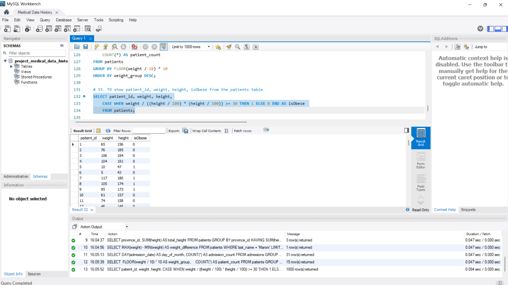
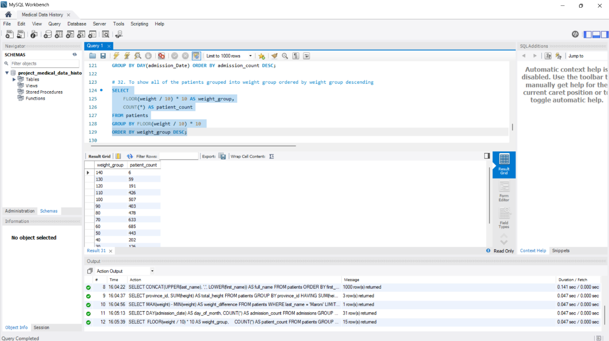
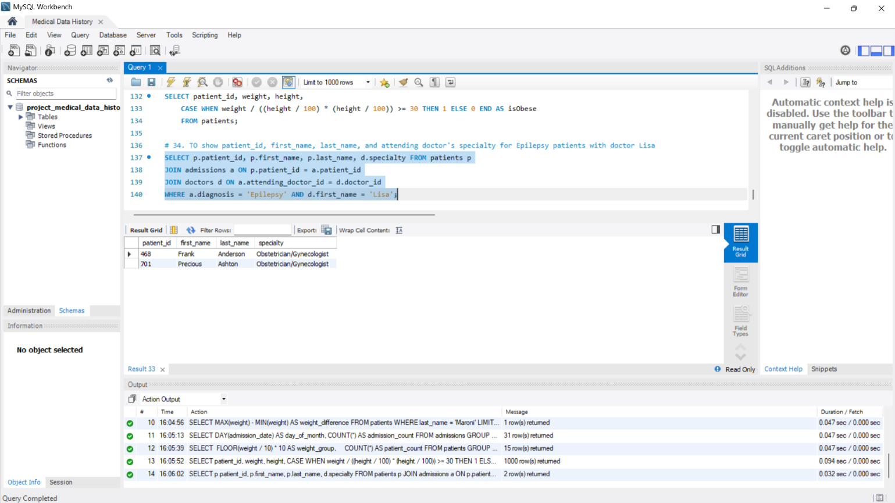

## Project Overview

This project was completed as part of my Data Analytics course. The objective was to analyze medical and patient historical data using SQL and perform various data analysis questions based on the provided data.

## Tools Used

* MySQL
* MySQL Workbench
* SQL

## SQL Concepts Applied

**Data retrieval & filtering**
SELECT · WHERE · AND/OR logic · IN · BETWEEN · NULL / NOT NULL checks

**String functions**
CONCAT · UPPER / LOWER · LENGTH · LIKE pattern matching

**Date functions**
YEAR() · date range filtering · DATE comparisons · chronological sorting

**Aggregation & grouping**
COUNT() · SUM() · MIN() / MAX() · AVG() · GROUP BY · HAVING

**Joins**
INNER JOIN across Patients, Admissions, Doctors, and Province Names

**Other**
ORDER BY · LIMIT · OFFSET · derived calculations (BMI from height and weight)

## Analysis
This project contains SQL queris developed to perform analytical questions using the medical data history database.

## Files
* Medical_Data_History_Analysis.sql - Contains the SQL queries used for the analysis.

## Key Finings
## Key Findings

### Patients classified by BMI

Calculated BMI from raw height and weight columns, then flagged obesity
as a boolean using conditional logic — deriving a new clinical metric
rather than just retrieving stored values.

### Patient distribution across weight bands

Patients grouped into 10kg bands using FLOOR arithmetic, revealing the
shape of the weight distribution across the population.

### Epilepsy patients by attending doctor

Joined patients, admissions, and doctors to identify which physicians
treated epilepsy cases — linking clinical condition to provider for
specialist workload analysis.

## Note
  The database used in the project was provided as part of my Data Analytics Course. Database credentials, connection details, and restricted source data are not included in this repository.
